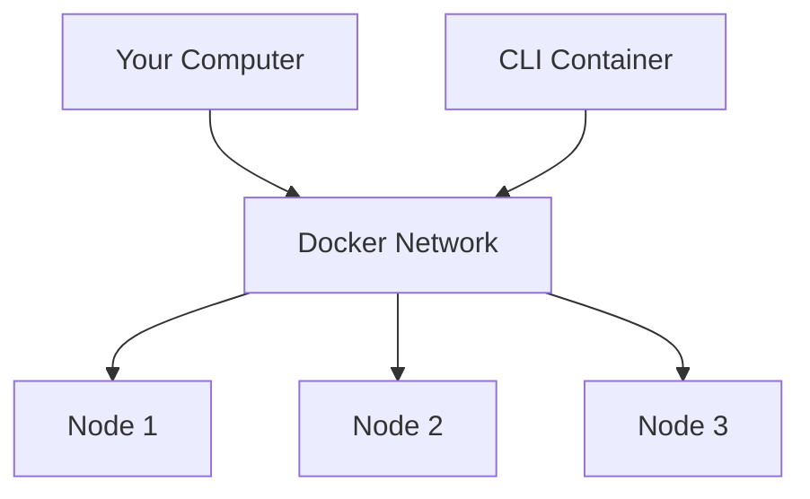

# Hands-on #1: Starting a cluster

This guide walks you through the process of setting up and running an GridGain cluster using Docker containers. Follow these steps to get a three-node cluster up and running quickly.

## Prerequisites

- Docker and Docker Compose installed on your system
- Basic familiarity with command-line operations
- Java 11 or higher installed (for connecting to the cluster)

## Setting Up an Apache Ignite 3 Cluster

Before we can start using SQL, we need to set up a multi-node Ignite cluster. We'll use Docker Compose to create a three-node cluster.



> [!NOTE]
> You can think of GridGain as being a distribution of Apache Ignite in much the same way that Debian is a distribution of Linux. Everything we cover here is correct for both Apache Ignite and GridGain.

## Step 1: Understand the Docker Compose Configuration

1. View the file named [`docker-compose.yml`](docker-compose.yaml) in the current directory:

## Step 2: Start the GridGain Cluster

1. Open a terminal in the directory containing your `docker-compose.yml` file
2. Run the following command to start the cluster:

```bash
docker compose up -d
```

3. Verify that all containers are running:

```bash
docker compose ps
```

You should see all three nodes with "running" status.

## Step 3: Initialize the Cluster

1. Ensure your license file is located in the same directory as your docker-compose.yaml file. A GridGain Community Edition or GridGain evaluation license will both work well for this exercise

2. Start the Ignite CLI in Docker:

```bash
docker run --rm -it --network=gridgain9_default -v ./gridgain-license.json:/opt/gridgain/downloads/gridgain-license.json gridgain/gridgain9:9.1.8 cli
```

> [!NOTE]
> If you have an evaluation license, a later version of Gridgain will also work. Switching the compose file to use Apache Ignite should also work but may not have been tested. We won't cover this during the workshop.

3. Inside the CLI, connect to one of the nodes:

```
connect http://node1:10300
```

4. Initialize the cluster with a name and metastorage group:

```
cluster init --name=gridgain9 --metastorage-group=node1,node2,node3 --license=/opt/gridgain/downloads/gridgain-license.json
```

5. Exit the CLI by typing `exit` or pressing Ctrl+D

## Step 4: Verify Your Cluster

To verify your cluster is running correctly, you can use a simple Java client to connect to it. Create a simple test class that establishes a connection to the cluster.

## Understanding Port Configuration

The Docker Compose file exposes two types of ports for each node:

- **10300-10302**: REST API ports for administrative operations
- **10800-10802**: Client connection ports for your applications

## Next steps

The lessons will resume shortly! Please don't shutdown your cluster yet.
