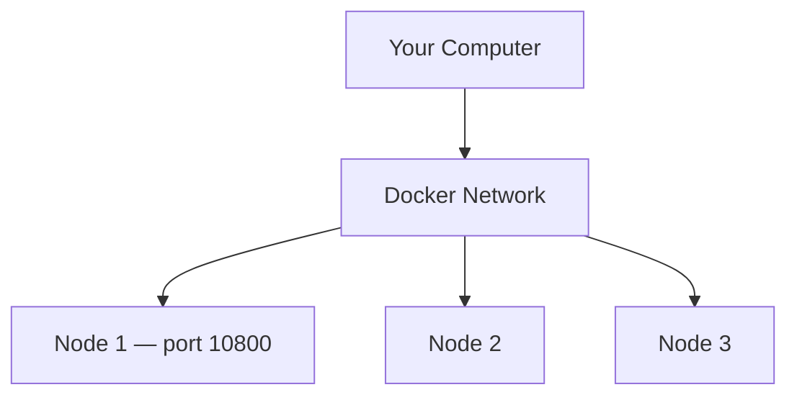

# Hands-on #1: Starting a Cluster

This guide walks you through setting up a three-node GridGain 8 Community Edition cluster using Docker Compose.

## Prerequisites

- Docker and Docker Compose installed on your system
- Basic familiarity with command-line operations

## Cluster Architecture


```mermaid
graph TD
    A[Your Computer] --> B[Docker Network]
    B --> C[Node 1 — port 10800]
    B --> D[Node 2]
    B --> E[Node 3]
```

> [!NOTE]
> You can think of GridGain as being a distribution of Apache Ignite in much the same way that Debian is a distribution of Linux. Everything we cover here is correct for both Apache Ignite and GridGain.

## Step 1: Understand the Docker Compose Configuration

Open [`../docker/docker-compose.yaml`](../docker/docker-compose.yaml) and review the configuration:

- **Image:** `gridgain/community:8.9.32-openjdk17` — GridGain 8 Community Edition with JDK 17.
- **3 server nodes** connected on a private Docker network. Node discovery uses a static IP list configured in `training-node-config.xml`.
- **Port 10800** (thin-client) is published on node1 so your local applications can connect.
- **Optional sidecar containers** (`app` for Java / Maven, `app-dotnet` for .NET 8) are available for students who don't have a local SDK. They start only when explicitly requested.

## Step 2: Start the GridGain Cluster

1. Open a terminal at the **repository root** (the directory that contains `docker/`, `handson1/`, `handson2/`, and `handson3/`).

2. Start the cluster:

```bash
docker compose -f docker/docker-compose.yaml up -d
```

3. Verify that all three nodes are running:

```bash
docker compose -f docker/docker-compose.yaml ps
```

You should see three containers with status "running" (or "Up").

## Step 3: Verify the Cluster

Check the logs from node1 to confirm the cluster formed:

```bash
docker compose -f docker/docker-compose.yaml logs node1 | grep "Topology snapshot"
```

You should see a line like:

```
Topology snapshot [ver=3, locNode=..., servers=3, clients=0, ...]
```

The `servers=3` confirms all three nodes have joined the cluster.

## Understanding Port Configuration

The Docker Compose file publishes one port:

- **10800** (on node1): Thin-client port — your Java or .NET application connects here.

Nodes communicate with each other over the internal Docker network using ports 47100 (communication) and 47500 (discovery). These are not published to the host.

## Next Steps

The lessons will resume shortly! Please don't shut down your cluster yet.
