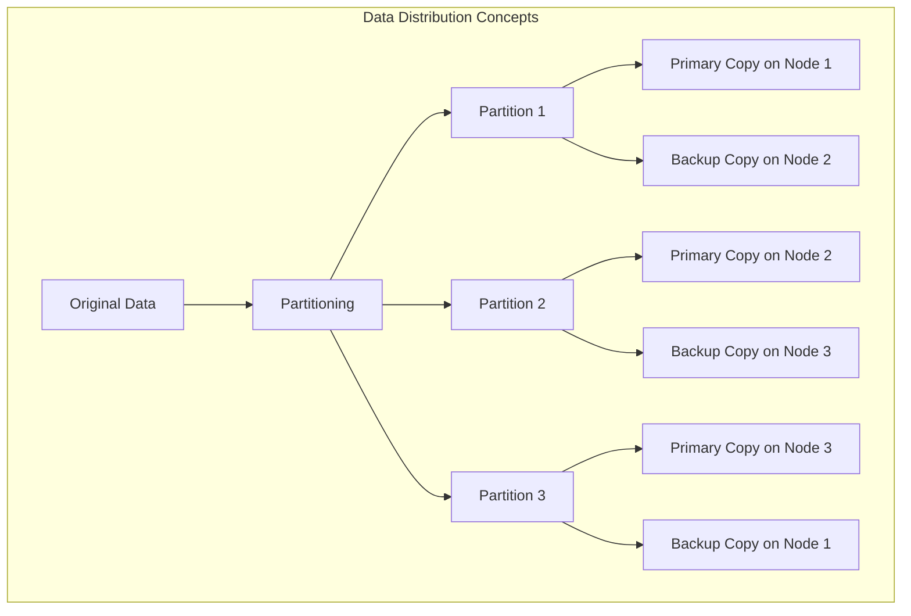
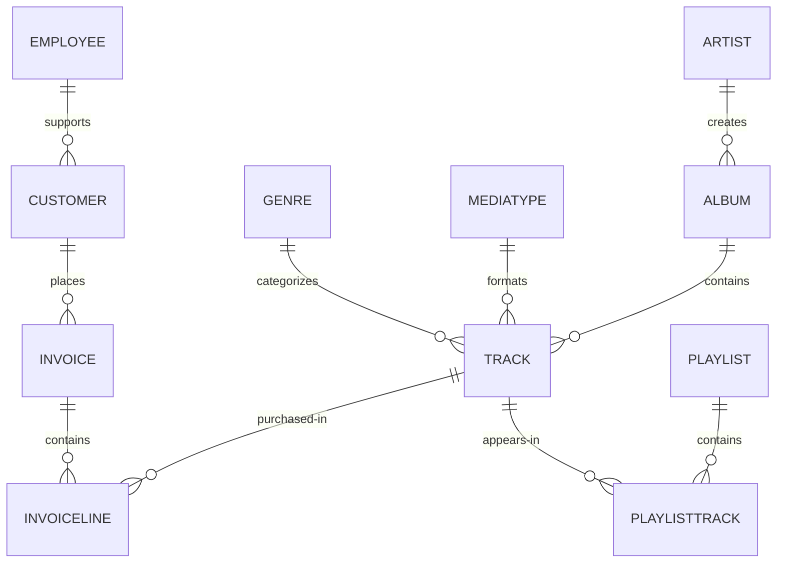
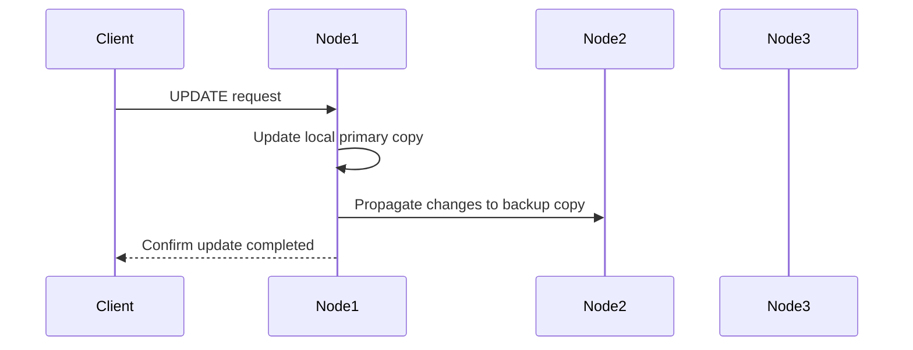

# Hands-on #2: SQL

This guide walks you through using GridGain 8's SQL capabilities via the `sqlline` command-line tool. Using the cluster you set up in hands-on #1, you'll create and manipulate the Chinook database (a sample database representing a digital media store) and learn to leverage GridGain's distributed SQL features.

## Prerequisites

* Completed hands-on #1 and have a running GridGain cluster
* Basic familiarity with SQL

## Connecting to the Cluster Using sqlline

We'll use `sqlline` — a JDBC command-line tool bundled inside the GridGain container — to run SQL against the cluster.

## Understanding Distributed Database Concepts

Before we dive into creating the schema, let's understand how GridGain distributes data across the cluster:



> [!IMPORTANT]
> In GridGain, data is distributed across nodes for scalability and fault tolerance. Each cache has a **mode** — *partitioned* (data spread across nodes) or *replicated* (full copy on every node). **Affinity colocation** ensures that related data from different tables is kept on the same node so that joins execute locally without network round-trips.

## Creating the Chinook Database Schema

### Loading the Database Schema

1. Open `sql/schema.sql` in a text editor or IDE. Examine the SQL — notice the `WITH` clause on each table that specifies the cache mode (`template=partitioned` or `template=replicated`) and colocation settings (`affinityKey`).

2. Copy the SQL files into the container:

```bash
docker compose -f docker/docker-compose.yaml cp handson2/sql/. node1:/opt/gridgain/work/sql/
```

3. Load the schema:

```bash
docker compose -f docker/docker-compose.yaml exec node1 /opt/gridgain/bin/sqlline.sh -u jdbc:ignite:thin://node1:10800 -f /opt/gridgain/work/sql/schema.sql
```

### Database Entity Relationship



### Key Schema Concepts

Your instructor will talk through some key GridGain 8 concepts visible in the schema:

* **Cache mode** — `partitioned` (data spread across nodes for scale) vs `replicated` (full copy on every node for fast lookups). In the DDL, this is set via `template=partitioned` or `template=replicated` in the `WITH` clause.
* **Affinity colocation** — the `affinityKey` parameter keeps related rows from different tables on the same node. For example, all Albums by Artist 22 land on the same node as Artist 22, so joins between them execute locally.
* **Backups** — `backups=1` means one backup copy of each partition exists on another node for fault tolerance.

### Verifying Table Creation

Start sqlline interactively:

```bash
docker compose -f docker/docker-compose.yaml exec node1 /opt/gridgain/bin/sqlline.sh -u jdbc:ignite:thin://node1:10800
```

Query the system tables view to see all tables, their cache names, and affinity key columns:

```sql
SELECT TABLE_NAME, CACHE_NAME, AFFINITY_KEY_COLUMN FROM SYS.TABLES;
```

You should see all 11 Chinook tables listed with their cache names and affinity key settings.

## Inserting Sample Data

Load the data (the SQL files were already copied in the previous step):

```bash
docker compose -f docker/docker-compose.yaml exec node1 /opt/gridgain/bin/sqlline.sh -u jdbc:ignite:thin://node1:10800 -f /opt/gridgain/work/sql/data.sql
```

Verify row counts — start sqlline interactively:

```bash
docker compose -f docker/docker-compose.yaml exec node1 /opt/gridgain/bin/sqlline.sh -u jdbc:ignite:thin://node1:10800
```

Then run:

```sql
SELECT 'Artist' AS tbl, COUNT(*) AS cnt FROM Artist
UNION ALL SELECT 'Album', COUNT(*) FROM Album
UNION ALL SELECT 'Track', COUNT(*) FROM Track
UNION ALL SELECT 'Customer', COUNT(*) FROM Customer
UNION ALL SELECT 'Invoice', COUNT(*) FROM Invoice;
```

Expected: Artist 275, Album 347, Track 3503, Customer 59, Invoice 412.

## Querying Data

### Basic Queries

All queries below are run inside sqlline.

```sql
-- Get all artists
SELECT * FROM Artist LIMIT 20;
```

```sql
-- Get all albums for a specific artist
SELECT * FROM Album WHERE ArtistId = 3;
```

```sql
-- Get all tracks for a specific album
SELECT * FROM Track WHERE AlbumId = 133;
```

### Joins

Get tracks with artist and album information:

```sql
SELECT
    t.Name AS TrackName,
    a.Title AS AlbumTitle,
    ar.Name AS ArtistName
FROM
    Track t
    JOIN Album a ON t.AlbumId = a.AlbumId
    JOIN Artist ar ON a.ArtistId = ar.ArtistId
LIMIT 10;
```

## Data Manipulation

### Understanding Distributed Updates

When you write data to a partitioned cache with backups, GridGain updates the primary copy first, then replicates the change to backup nodes. By default, the write synchronization mode is `PRIMARY_SYNC` — the client gets confirmation once the primary node has the data, and the backup is updated asynchronously. For stronger consistency, caches can be configured with `FULL_SYNC` mode, where the client waits for both primary and backup to confirm. See [Configuring Backups](https://www.gridgain.com/docs/gridgain8/latest/developers-guide/configuring-caches/configuring-backups) for details.



### Inserting New Data

Insert a new artist:

```sql
INSERT INTO Artist (ArtistId, Name) VALUES (276, 'New Discovery Band');
```

Insert a new album for this artist:

```sql
INSERT INTO Album (AlbumId, Title, ArtistId, ReleaseYear) VALUES (348, 'First Light', 276, 2023);
```

Verify the insertions:

```sql
SELECT * FROM Artist WHERE ArtistId = 276;
```

```sql
SELECT * FROM Album WHERE AlbumId = 348;
```

### Updating Existing Data

```sql
UPDATE Album SET ReleaseYear = 2024 WHERE AlbumId = 348 AND ArtistId = 276;
```

```sql
UPDATE Artist SET Name = 'New Discovery Ensemble' WHERE ArtistId = 276;
```

### Deleting Data

```sql
DELETE FROM Album WHERE AlbumId = 348 AND ArtistId = 276;
```

```sql
DELETE FROM Artist WHERE ArtistId = 276;
```

## Advanced SQL Features

### Creating Indexes

```sql
CREATE INDEX idx_track_name ON Track (Name);
```

```sql
CREATE INDEX idx_album_artist ON Album (ArtistId, Title);
```

```sql
CREATE INDEX idx_customer_email ON Customer (Email);
```

### Execution Plans

You can inspect how GridGain processes a query with EXPLAIN:

```sql
EXPLAIN SELECT
    a.Title,
    ar.Name
FROM
    Album a
    JOIN Artist ar ON a.ArtistId = ar.ArtistId
WHERE ar.ArtistId = 22;
```

The plan shows which indexes are used for the join. Look for `AFFINITY_KEY` — this indicates the join uses the affinity key index, meaning the data is colocated and the join executes locally on the node that owns Artist 22's partition.

> [!TIP]
> Sometimes the full execution plan is truncated. You can tell sqlline how wide your terminal is with the "set" command: `!set maxwidth 500`


> [!NOTE]
> EXPLAIN shows the query plan — indexes used and join order. The distributed execution layer (how work is split across nodes) is transparent. Colocation benefits don't appear explicitly in the plan; they show up as faster execution because no data needs to move between nodes.

### Colocation Strategy Summary

Affinity colocation groups related rows from different tables onto the same node, so joins between them don't require network round-trips:

* Albums are colocated by `ArtistId` — all albums by a given artist live on the same node as that artist
* Tracks are colocated by `AlbumId` — all tracks on a given album live with that album
* Invoices are colocated by `CustomerId` — a customer's invoices live with the customer record
* InvoiceLines are colocated by `InvoiceId` — line items live with their parent invoice

## Dashboard Queries

### Monthly Sales Summary

```sql
SELECT
    CAST(EXTRACT(YEAR FROM i.InvoiceDate) AS VARCHAR) || '-' ||
    CASE
        WHEN EXTRACT(MONTH FROM i.InvoiceDate) < 10
        THEN '0' || CAST(EXTRACT(MONTH FROM i.InvoiceDate) AS VARCHAR)
        ELSE CAST(EXTRACT(MONTH FROM i.InvoiceDate) AS VARCHAR)
    END AS YearMonth,
    COUNT(DISTINCT i.InvoiceId) AS InvoiceCount,
    SUM(i.Total) AS MonthlyRevenue
FROM Invoice i
GROUP BY EXTRACT(YEAR FROM i.InvoiceDate), EXTRACT(MONTH FROM i.InvoiceDate)
ORDER BY YearMonth DESC
LIMIT 12;
```

### Top Selling Genres

```sql
SELECT
    g.Name AS Genre,
    SUM(il.UnitPrice * il.Quantity) AS Revenue
FROM
    InvoiceLine il
    JOIN Track t ON il.TrackId = t.TrackId
    JOIN Genre g ON t.GenreId = g.GenreId
GROUP BY g.Name
ORDER BY Revenue DESC;
```

### Top 20 Longest Tracks

```sql
SELECT
    t.TrackId,
    t.Name AS TrackName,
    g.Name AS GenreName,
    ROUND(t.Milliseconds / (1000.0 * 60), 2) AS DurationMinutes
FROM
    Track t
    JOIN Genre g ON t.GenreId = g.GenreId
WHERE t.GenreId < 17
ORDER BY DurationMinutes DESC
LIMIT 20;
```

## Cleaning Up

Exit sqlline:

```
!quit
```

Leave your cluster running — we'll use it in the next hands-on session.

## Best Practices

### Schema Design
* Use affinity colocation for tables that are frequently joined
* Choose primary keys that distribute data evenly across the cluster
* Use replicated caches for small lookup tables accessed in many joins

### Query Optimization
* Create indexes for columns used in WHERE, JOIN, and ORDER BY clauses
* Use EXPLAIN to analyze query plans
* Leverage affinity colocation to keep joined data on the same node

## Summary

In this guide, you've learned:

1. How to create a distributed database schema with partitioned and replicated caches
2. How to load and query data using SQL via sqlline
3. How to perform data manipulation in a distributed environment
4. How affinity colocation groups related data on the same node for efficient joins
5. How to build analytical queries for business intelligence
